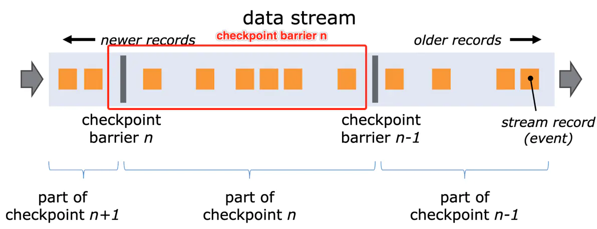
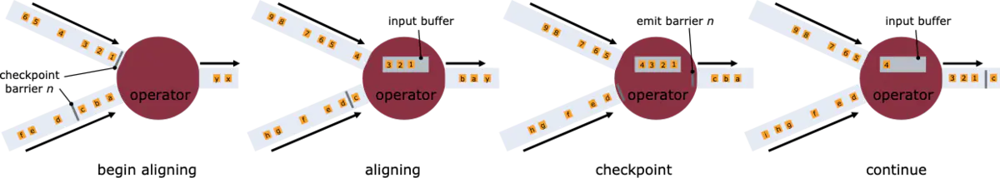
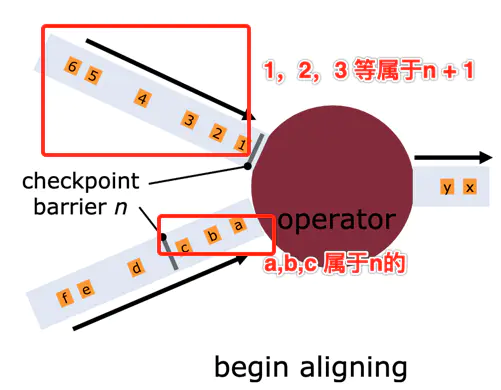
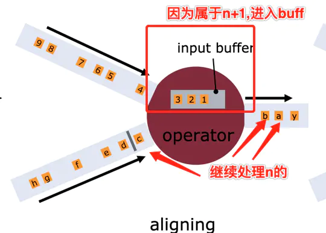
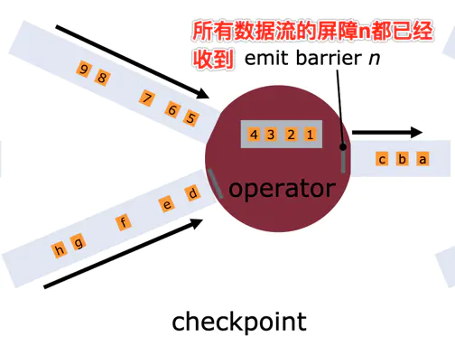
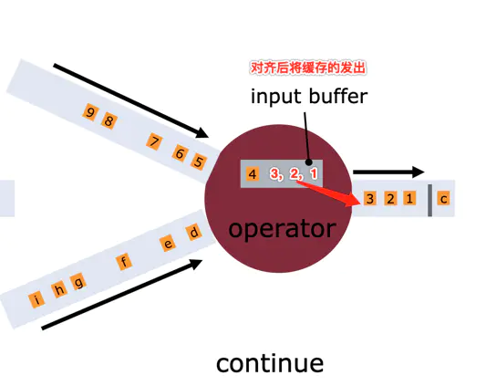
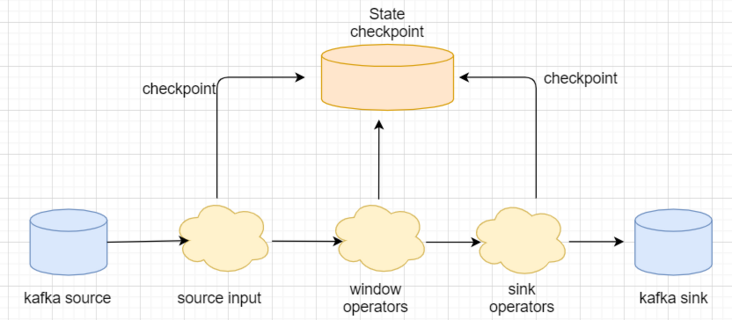
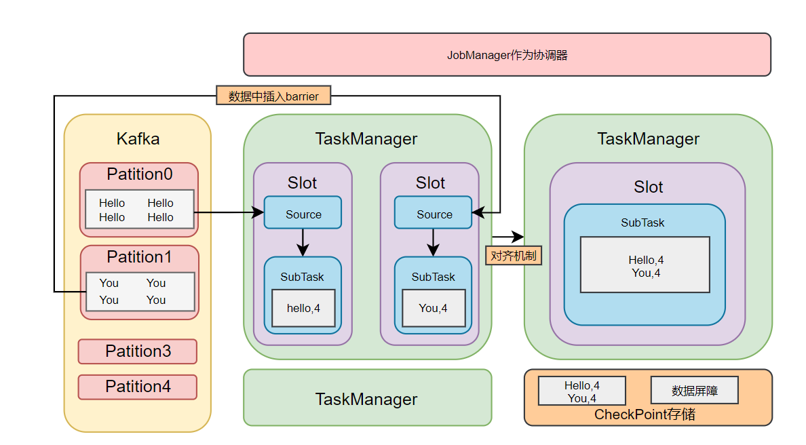
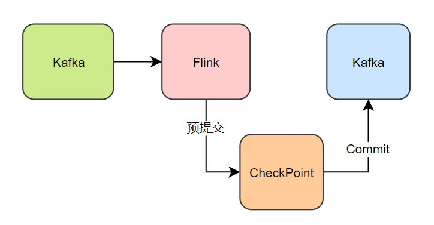

# Exactly-Once

**定义**： 精确一次（Exactly-Once）：表示每一条数据只会被精确地处理一次，不多也不少 ；

这包含两方面的内容：

- 怎么保证数据不丢失
- 怎么保证数据不重复

Flink甚至可以保证端到端的精确一次语义；

Flink借助**分布式快照**和**两阶段提交**来实现

## 分布式快照

 Flink提供了失败恢复的容错机制，而这个容错机制的核心就是持续创建分布式数据流的快照来实现，这也为了数据不丢失提供了基础保障。 

>  同Spark相比，Spark仅仅是针对Driver的故障恢复Checkpoint。而Flink的快照可以到算子级别，并且对全局数据也可以做快照。 

-  Flink快照主要包括两部分数据一部分是数据流的数据，另一部分是operator的状态数据。 
-  对应的快照机制的实现有主要两个部分组成，一个是屏障(Barrier），一个是状态(State) 

### 屏障 Barrier

Flink 分布式快照里面的一个核心的元素就是流屏障（stream barrier）。这些屏障会被插入(injected)到数据流中，并作为数据流的一部分随着数据流动。屏障并不会持有任何数据，而是和数据一样线性的流动。可以看到屏障将数据流分成了两部分数据（实际上是多个连续的部分），一部分是当前快照的数据，一部分下一个快照的数据。每个屏障会带有它的快照ID。这个快照的数据都在这个屏障的前面。从图上看，数据是从左向右移动（右边的先进入系统），那么快照n包含的数据就是右侧到下一个屏障（n-1）截止的数据，图中两个灰色竖线之间的部分，也就是part of  checkpoint n。另外屏障并不会打断数的流动,因而屏障是非常轻量的。在同一个时刻，多个快照可以在同一个数据流中，这也就是说多个快照可以同时产生。

  

如果是多个输入数据流，多个数据流的屏障会被同时插入到数据流中。快照n的屏障被插入到数据流的点（我们称之为Sn），就是数据流中一直到的某个位置（包含了当前时刻之前时间的所有数据），也就是包含的这部分数据的快照。举例来说，在Kafka中，这个位置就是这个分区的最后一条记录的offset。这个位置Sn就会上报给 checkpoint 的协调器（Flink的 JobManager）。

然后屏障开始向下流动。当一个中间的operator收到它的所有输入源的快照n屏障后，它就会向它所有的输出流发射一个快照n的屏障，一旦一个sink的operator收到所有输入数据流的屏障n，它就会向checkpoint的协调器发送快照n确认。当所有的sink都确认了快照n，系统才认为当前快照的数据已经完成。

一旦快照n已经执行完成，任务则不会再请求Sn之前的数据，因为此刻，这些数据都已经完全通过了数据流拓扑图。

### 对齐机制

接收不止一个数据输入的operator需要基于屏障**对齐**输入数据流。整个流程图如下所示：

  

- 当operator接收到快照的屏障n后并不能直接处理之后的数据，而是需要等待其他输入快照的屏障n。否则话，将会将快照n的数据和快照n+1的数据混在一起。图中第一个所示，operator即将要收到数据流1(上面这个当作数据流1（6，5，4，3，2，1），下面的当成数据流2)的屏障n，1，2，3在屏障n之后到达operator，这个时候如果数据流1的继续处理，那么operator中就会包含n屏障之后的数据（1，2，3），但是operator中此刻在接收和处理数据流2，数据（a,b,c）就会和数据流1中的（1，2，3）混合。

    

- 快照n的数据流会被暂时放到一边。从这些数据流中获取到的数据不会被处理，而是存储到一个缓冲中。图中第一个所示，因为数据流2的屏障n还没到，所以operator持续接收1，2，3然而并不做任何处理。但是需要将1，2，3存入到buffer中。此时第二个数据流接到a，b，则直接发送，接到c发送c。

  

- 一旦最后一个数据流收到了快照n，opertor就会将发出所有阻塞的数据，并发出自己的屏障。如图中第三个所示，operator最后收到了另一个数据流的屏障n，然后再发出a,b,c(图中operator中的c,b,a)以后，发出自己的屏障，这个时候buffer中又增加了一个4，变成（4，3，2，1）。

  

- 之后operator会重新开始处理所有的输入数据流，先处理buffer中的数据，处理完之后再处理输入数据流的数据。如图第四个所示，先将buffer中的1，2，3，4先处理完，在接收并处理这两个数据源的数据。

  

### 异步与增量

- Flink的快照存储采用异步方式，不会打断正在执行的任务
- Flink采用增量快照，每次的快照都是在上一次的基础上做增量更新

## 两阶段提交

前文提到基于checkpoint的快照操作，快照机制能够保证作业出现fail-over后可以从最新的快照进行恢复，即分布式快照机制可以保证flink系统内部的”精确一次“处理。但是实际生产系统中，Flink会对接各种各样的外部系统，比如kafka，HDFS等，一旦Flink作业出现失败，作业会重新消费旧数据，这个时候就会出现重新消费的情况，也就是重复消费的问题。 

针对这种情况，Flink在1.4版本引入了一个很重要得功能：**两阶段提交**，也即是`TwoPhaseCommitSinkFunction`。两阶段搭配特定的source和sink（特别是0.11版本kafka）使得”精确一次处理语义“成为可能。 

 在Flink中两阶段提交的实现方式被封装到TwoPhaseCommitSinkFunction这个抽象类中，我们只需要实现其中的beginTransaction,preCommit,commit,abort四个方法就可实现”精确一次“的处理语义：

- beginTransaction，在开启事务之前，在目标文件系统的临时目录中创捷一个临时文件，后面在处理数据时将数据写入此文件。
- preCommit，在预提交阶段，刷写（flush）文件，然后关闭文件，之后就不能再写入文件了。将为属于下一个检查点的任何后续写入启动新事务。
- commit，在提交阶段，我们将预提交的文件原子性的移动到真正的目标目录中，这里会增加输出数据可见性的延迟
- abort，在中止阶段，删除临时文件。

## 端到端精确一次

  

如上图所示，Kafka-Flink-Kafka案例实现**”端到端精确一次“**语义的过程，整个过程包括：

- 从kafka读取数据
- 窗口聚合操作
- 将数据写回kafka

整个过程可以总结为下面两个流程示例【下面都是个人的一种理解，如果有误，后续深入后再回来修正】：





# 多流Join

## Flink中可选的三种数据Join方式

1、使用DataStream的API，我们使用connect操作，然后再使用RichFlatMapFunction或者是CoProcessFunction中手动实现Join，它们可以将数据保持在state中，在CoProcessFunction中可以使用计时器，定时进行数据的关联，然后定期清理过期的state。

2、使用Table API，我们自己实现一个UDTF来访问维表

3、使用流JOIN来实现

下面还是主要关注Flink中的多流Join

## 多流JOIN

流的Join也分为两种，Window Join和 Interval Join

### Window Join

窗口join会join具有相同的key并且处于同一个窗口中的两个流的元素

- 所有的窗口join都是inner join, 意味着a流中的元素如果在b流中没有对应的, 则a流中这个元素就不会处理(就是忽略掉了)
- join成功后的元素的会以所在窗口的最大时间作为其时间戳. 例如窗口[5,10), 则元素会以9作为自己的时间戳

#### 滚动窗口Join

  

#### 滑动窗口Join

   

#### 会话窗口Join

  

### Interval Join

间隔流join(Interval Join), 是指使用一个流的数据按照key去join另外一条流的指定范围的数据

需要注意的是： Interval Join只支持事件时间。 

如下图: 橙色的流去join绿色的流. 范围是由橙色流的event-time + lower bount和event-time + upper bount的范围来决定的.

> orangeElem.ts + lowerBound <= greenElem.ts <= orangeElem.ts + upperBound

  

其中，上界和下界可以是负数，也可以是正数。Interval join目前只支持INNER JOIN。将连接后的元素传递给ProcessJoinFunction时，时间戳变为两个元素中最大的那个时间戳。 

### 代码实践

以上知识点相关代码路径

```
[flink-java-learn]   org.azhell.learn.flink.jointest
```

> 参考博文：
>
> [Flink中如何做流Join](https://zhuanlan.zhihu.com/p/340560908) 
>
> [Flink双流join](https://blog.csdn.net/weixin_42796403/article/details/114713553) 

