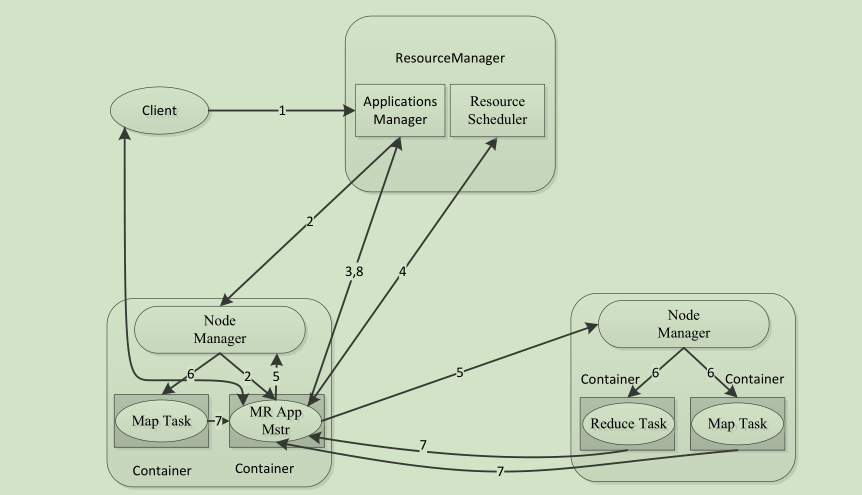
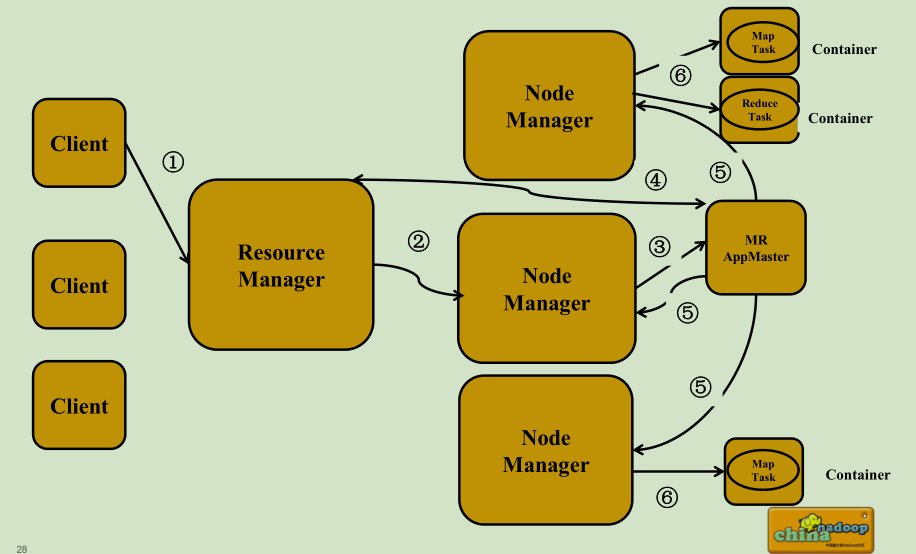
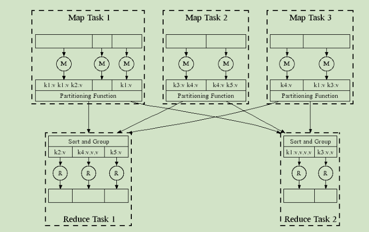
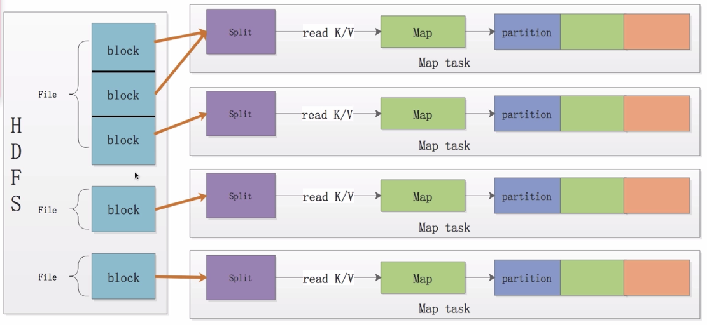
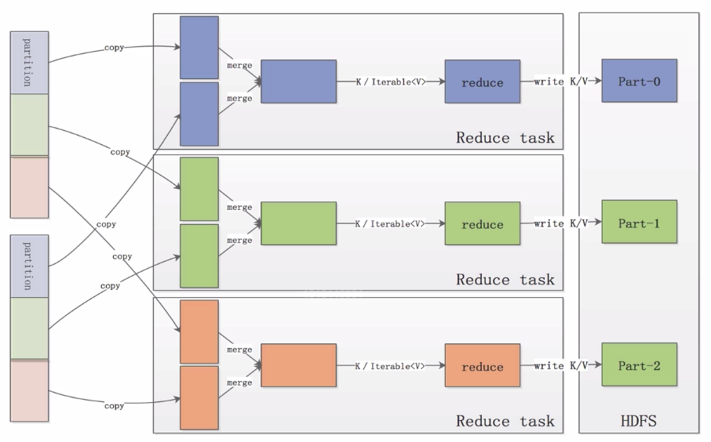
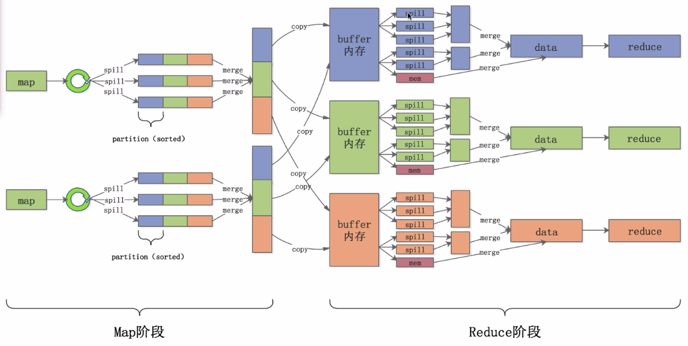
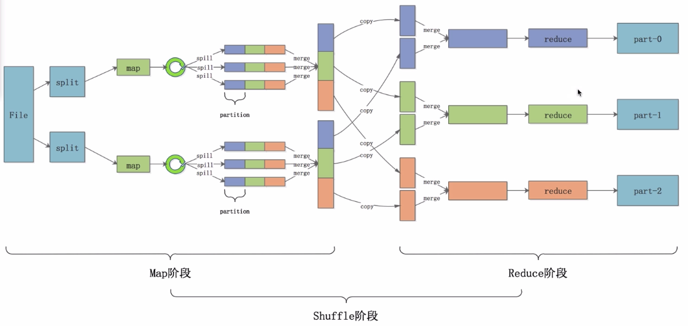

# MapReduce工作原理

> 参考博客： 
>
> - [Hadoop之MapReduce运行原理（一）](https://blog.csdn.net/u013850277/article/details/59792145) 
>
> - [MR的原理和运行流程](https://blog.csdn.net/qq_31975963/article/details/84995460) 

## MapReduce 2.0提交任务

 ### 架构流程

 

>  a、Client
>     与MapReduce 1.0 的Client类似，用户通过Client与YARN交互，提交MapReduce作业，查询作业运行状态，管理作业等。
>    
>  b、MRAppMaster
>     功能类似于 1.0 中的JobTracker ，但不负责资源管理；
>     功能包括：任务划分、资源申请并将之二次分配个Map Task和Reduce Task。

### 分解流程

 

> a、MRAppMaster 容错性
>    一旦运行失败，由YARN 的ResourceManager 负责重新启动，最多重启次数可由用户设置，默认是2 次。一旦超过最高重启次数，则作业运行失败。
>
> b、Map Task/Reduce Task
>   Task 周期性向MRAppMaster 汇报心跳；
>   一旦Task 挂掉，则MRAppMaster 将为之重新申请资源，并运行之。最多重新运行次数可由用户设置，默认4 次。 

### 推测执行机制

>    1、作业完成时间取决于最慢的任务完成时间
>        一个作业由若干个Map 任务和Reduce 任务构成
>        因硬件老化、软件Bug 等，某些任务可能运行非常慢
>        典型案例：系统中有99%的Map任务都完成了，只有少数几个Map老是进度很慢，完不成，怎么办？
>
>    2、推测执行机制：
>        发现拖后腿的任务，比如某个任务运行速度远慢于任务平均速度
>        为拖后腿任务启动一个备份任务，同时运行
>        谁先运行完，则采用谁的结果
>
>    3、不能启用推测执行机制
>       任务间存在严重的负载倾斜
>       特殊任务，比如任务向数据库中写数据  
>
>    参考文章： [Hadoop之推测执行](https://blog.csdn.net/qianshangding0708/article/details/47615167) 

## 任务执行流程

### 任务并行执行

  

### 任务执行分解

 

### Map的运行过程

以HDFS上的文件作为默认输入源为例

  

- block是HDFS上的文件块，split是文件的分片（逻辑划分，不包含具体数据，只包含这些数据的位置信息）。
  -  一个split包含一个或多个block，默认是一对一的关系。

  - 一个split不包含两个文件的block， 不会跨越file边界，也就是说一个split是不会跨文件进行划分的。

- 当分片完成后，MR程序会将split中的数据以K/V（key/value）的形式读取出来，然后将这些数据交给用户自定义的Map函数进行处理。

  - 一个Map处理一个split。

- 用户用Map函数处理完数据后将处理后，同样将结果以K/V的形式交给MR的计算框架。

- MR计算框架会将不同的数据划分成不同的partition，数据相同的多个partition最后会分到同一个reduce节点上面进行处理，也就是说一类partition对应一个reduce。

- Map默认使用Hash算法对key值进行Hash计算，这样保证了相同key值的数据能够划分到相同的partition中，同时也保证了不同的partition之间的数据量时大致相当的， [参考链接](https://zhuanlan.zhihu.com/p/42864264) 

- 一个程序中Map和Reduce的数量是有split和partition的数据决定的。

### Reduce处理过程

  

- Map处理完后，reduce处理程序在各个Map节点将属于自己的数据拷贝到自己的内存缓冲区中
- 最后将这些数据合并成一个大的数据集，并且按照key值进行聚合，把聚合后的value值作为一个迭代器给用户使用。
- 用户使用自定义的reduce函数处理完迭代器中的数据后，一般把结果以K/V的格式存储到HDFS上的文件中。

### Shuffle过程

>  在上面介绍的MR过程中，还存在一个shuffle过程，发生与Map和Reduce之中。

####  **Map中的shuffle** 

- Collec阶段键数据放在环形缓冲区，环形缓冲区分为数据区和索引区。
- sort阶段对在统一partition内的索引按照key值排序。
- spill（溢写）阶段根据排好序的索引将数据按顺序写到文件中。
- Merge阶段将Spill生成的小文件分批合并排序成一个大文件。

####  Reduce中的shuffle 

- Copy阶段将Map段的数据分批拷贝到Reduce的缓冲区。
- Spill阶段将内存缓冲区的数据按照顺序写到文件中。
- Merge阶段将溢出文件合并成一个排好序的数据集。

####  Combine优化 

> 整个过程中可以提前对聚合好的value值进行计算，这个过程就叫Combine。

- Combine在Map端发生时

  - 在数据排序后，溢写到磁盘前，相同key值的value是紧挨在一起的，可以进行聚合运算，运行一次combiner。
  - 再合并溢出文件输出到磁盘前，如果存在至少3个溢出文件，则运行combiner，可以通过min.num.spills.for.combine设置阈值。
- Reduce端

  - 在合并溢出文件输出到磁盘前，运行combiner。
- Combiner不是任何情况下都适用的，需要根据业务需要进行设置。

### MR运行过程

- 一个文件分成多个split数据片。
- 每个split由最多一个map进行处理。
- Map处理完一个数据就把处理结果放到一个环形缓冲区内存中。
- 环形缓冲区满后里面的数据会被溢写到一个个小文件中。
- 小文件会被合并成一个大文件，大文件会按照partition进行排序。
- reduce节点将所有属于自己的数据从partition中拷贝到自己的缓冲区中，并进行合并。
- 最后合并后的数据交给reduce处理程序进行处理。
- 处理后的结果存放到HDFS上。
- MR运行在集群上：YARN（Yet Another Resource Negotiator）