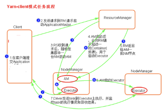

## Yarn

> 参考博客
>
> -  [MR的原理和运行流程](https://blog.csdn.net/qq_31975963/article/details/84995460) 

## Yarn调度任务流程

> Yarn 中的主要组件包括：Resourcemanager,ApplicationMaster, NodeManager。

### Resourcemanager

每个Hadoop集群只会有一个ResourceManager（如果是HA的话会存在两个，但是有且只有一个处于active状态），启动每一个 Job 所属的 ApplicationMaster,另外监控ApplicationMaster 以及NodeManager 的存在情况，并且负责协调计算节点上计算资源的分配。ResourceManager 内部主要有两个组件：

#### Scheduler

这个组件完全是插拔式的，用户可以根据自己的需求实现不同的调度器，目前YARN提供了FIFO、容量以及公平调度器。这个组件的唯一功能就是给提交到集群的应用程序分配资源，并且对可用的资源和运行的队列进行限制。Scheduler并不对作业进行监控；

#### ApplicationsManager 

这个组件用于管理整个集群应用程序的 application masters，负责接收应用程序的提交；为application master启动提供资源；监控应用程序的运行进度以及在应用程序出现故障时重启它。

### ApplicationMaster

每个 Job 都有对应一个 ApplicationMaster ，并且负责运行 mapreduce 任务，并负责报告任务的状态。ApplicationMaster是应用程序级别的，每个ApplicationMaster管理运行在YARN上的应用程序。YARN 将 ApplicationMaster看做是第三方组件，ApplicationMaster负责和ResourceManager scheduler协商资源，并且和NodeManager通信来运行相应的task。ResourceManager 为 ApplicationMaster 分配容器，这些容器将会用来运行task。ApplicationMaster 也会追踪应用程序的状态，监控容器的运行进度。当容器运行完成， ApplicationMaster 将会向 ResourceManager 注销这个容器；如果是整个作业运行完成，其也会向 ResourceManager 注销自己，这样这些资源就可以分配给其他的应用程序使用了。

### NodeManager

负责启动和管理节点的容器。NodeManager是YARN中每个节点上的代理，它管理Hadoop集群中单个计算节点，根据相关的设置来启动容器的。NodeManager会定期向ResourceManager发送心跳信息来更新其健康状态。同时其也会监督Container的生命周期管理，监控每个Container的资源使用（内存、CPU等）情况，追踪节点健康状况，管理日志和不同应用程序用到的附属服务（auxiliary service）。

### Container

 Container是与特定节点绑定的，其包含了内存、CPU磁盘等逻辑资源。不过在现在的容器实现中，这些资源只包括了内存和CPU。容器是由 ResourceManager scheduler 服务动态分配的资源构成。容器授予 ApplicationMaster 使用特定主机的特定数量资源的权限。ApplicationMaster 也是在容器中运行的，其在应用程序分配的第一个容器中运行。

必须牢记yarn只是一个资源管理的框架，并不是一个计算框架，计算框架可以运行在yarn上。我们所能做的就是向RM申请container,然后配合NM一起来启动container。

  

下面是请求资源和分配资源的流程：

1. 客户端向 ResourceManager 发送 job 请求，客户端产生的 RunJar 进程与 ResourceManager 通过 RPC 通信。
2. ResourceManager 向客户端返回 job 相关资源的提交路径以及 jobID。
3. 客户端将 job 相关的资源提交到相应的共享文件夹下。
4. 客户端向 ResourceManager 提交 job
5. ResourceManager 通过__调度器__在 NodeManager 创建一个容器，并且在容器中启用MRAppmaster 进程，该进程由 ResourceManager 启动。
6. 该 MRAppmaster 进程对作业进行初始化，创建多个对象对作业进行跟踪。
7. MRAppmaster 从文件系统获取计算得到输入分片，只获取切片信息，不需要jar等资源，为每个分片创建一个 map 以及指定数量的 reduce 对象，之后 MRAppmaster 决定如何运行构成 mapreduce 的各个任务。
8. 若作业很大，MRAppmaster 为所有的 map 任务和reduce 任务向 ResourceManger 发起申请容器的请求，请求中包含 map 任务的数据本地化信息以及数据分片等信息。
9. ResourceManager 为任务分配了容器之后，MRAppmaster 就通过 与 NodeManger 通信启动容器，由 MRAppmaster 负责分配在哪些 NodeManager 负责分配在哪些 NodeManager 上运行map （即 yarn child 进程）和reduce 任务。
10. 运行 map 和 reduce 任务的 NodeManager 从共享系统中获取 job 的相关信息，包括 jar 文件，配置文件等。
11. 关于查询状态，不经过 reourcemanager ，而是任务周期性的 MRAppmaster 汇报状态以及进度，客户端每秒通过查询一次 MRAppmaster 来更新状态和信息。
