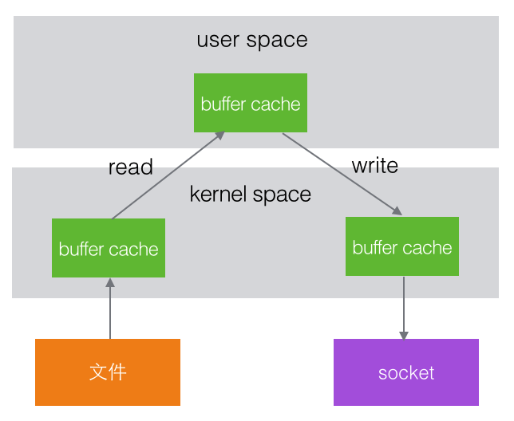
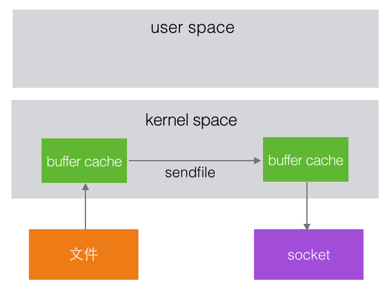

## Kafka如何实现高吞吐

> 参考文章：
>
> -  [Kafka是如何实现高吞吐率的](https://cloud.tencent.com/developer/article/1083674) 

Kafka是分布式消息系统，需要处理海量的消息，Kafka的设计是把所有的消息都写入速度低容量大的硬盘，以此来换取更强的存储能力，但实际上，使用硬盘并没有带来过多的性能损失 kafka主要使用了以下几个方式实现了超高的吞吐率 

###  **顺序读写** 

 kafka的消息是不断追加到文件中的，这个特性使kafka可以充分利用磁盘的顺序读写性能 顺序读写不需要硬盘磁头的寻道时间，只需很少的扇区旋转时间，所以速度远快于随机读写 Kafka官方给出了测试数据(Raid-5，7200rpm)： 

> - 顺序 I/O: 600MB/s 
>
> - 随机 I/O: 100KB/s 

###  **零拷贝** 

先简单了解下文件系统的操作流程，例如一个程序要把文件内容发送到网络这个程序是工作在用户空间，文件和网络socket属于硬件资源，两者之间有一个内核空间在操作系统内部，整个过程为： 



在Linux kernel2.2 之后出现了一种叫做"零拷贝(zero-copy)"系统调用机制，就是跳过“用户缓冲区”的拷贝，建立一个磁盘空间和内存的直接映射，数据不再复制到“用户态缓冲区” 系统上下文切换减少为2次，可以提升一倍的性能 



### 文件分段

 kafka的队列topic被分为了多个区partition，每个partition又分为多个段segment，所以一个队列中的消息实际上是保存在N多个片段文件中 


通过分段的方式，每次文件操作都是对一个小文件的操作，非常轻便，同时也增加了并行处理能力

### 批量发送

Kafka允许进行批量发送消息，先将消息缓存在内存中，然后一次请求批量发送出去 比如可以指定缓存的消息达到某个量的时候就发出去，或者缓存了固定的时间后就发送出去 如100条消息就发送，或者每5秒发送一次 这种策略将大大减少服务端的I/O次数 

###  **数据压缩**

 Kafka还支持对消息集合进行压缩，Producer可以通过GZIP或Snappy格式对消息集合进行压缩 压缩的好处就是减少传输的数据量，减轻对网络传输的压力 Producer压缩之后，在Consumer需进行解压，虽然增加了CPU的工作，但在对大数据处理上，瓶颈在网络上而不是CPU，所以这个成本很值得 

----

## Kafka如何实现精确一次语义

> 参考文章： [Kafka 是如何实现精确一次（exactly once）语义的?](https://www.lixueduan.com/post/kafka/10-exactly-once-impl/) 

### 概述

所谓的消息交付可靠性保障，是指 Kafka 对 Producer 和 Consumer 要处理的消息提供什么样的承诺。常见的承诺有以下三种：

- 最多一次（at most once）：消息可能会丢失，但绝不会被重复发送。
- 至少一次（at least once）：消息不会丢失，但有可能被重复发送。
- 精确一次（exactly once）：消息不会丢失，也不会被重复发送。

目前，Kafka **默认提供**的交付可靠性保障是第二种，即**`至少一次`**。

这样虽然不会丢失消息，但会导致消息**重复发送**。

Kafka 也可以提供最多一次交付保障，只需要让 Producer 禁止重试即可。

这样一来肯定不会重复发送，但是可能会丢失消息。

> 无论是至少一次还是最多一次，都不如精确一次来得有吸引力。大部分用户还是希望消息只会被交付一次，这样的话，消息既不会丢失，也不会被重复处理。 

**Kafka 分别通过 幂等性（Idempotence）和事务（Transaction）这两种机制实现了 精确一次（exactly once）语义。** 

### 幂等性（Idempotence）

`幂等`这个词原是数学领域中的概念，指的是某些操作或函数能够被执行多次，但每次得到的结果都是不变的。

**幂等性最大的优势在于我们可以安全地重试任何幂等性操作，反正它们也不会破坏我们的系统状态。**

在 Kafka 中，Producer 默认不是幂等性的，但我们可以创建幂等性 Producer。它其实是 0.11.0.0 版本引入的新功能。指定 Producer 幂等性的方法很简单，仅需要设置一个参数即可，即 

```java
props.put(“enable.idempotence”, true)
// 或者如下设置
props.put(ProducerConfig.ENABLE_IDEMPOTENCE_CONFIG， true)
```

enable.idempotence 被设置成 true 后，Producer 自动升级成幂等性 Producer，其他所有的代码逻辑都不需要改变。Kafka 自动帮你做消息的重复去重。

底层具体的原理很简单，就是经典的用`空间去换时间`的优化思路，即**在 Broker 端多保存一些字段。当 Producer 发送了具有相同字段值的消息后，Broker 能够自动知晓这些消息已经重复了，于是可以在后台默默地把它们“丢弃”掉**。

>  当然，实际的实现原理并没有这么简单，但你大致可以这么理解。 

Kafka 为了实现幂等性，它在底层设计架构中引入了 ProducerID 和 SequenceNumber。

Producer 需要做的只有两件事：

- 初始化时像向 Broker 申请一个 ProducerID
- 为每条消息绑定一个 SequenceNumber

Kafka Broker 收到消息后会以 ProducerID 为单位存储 SequenceNumber，也就是说即时 Producer 重复发送了， Broker 端也会将其过滤掉。

实现比较简单，同样的限制也比较大：

- 首先，它只能保证单分区上的幂等性。即一个幂等性 Producer 能够保证某个主题的一个分区上不出现重复消息，它无法实现多个分区的幂等性。
  - 因为 SequenceNumber 是以 Topic + Partition 为单位单调递增的，如果一条消息被发送到了多个分区必然会分配到不同的 SequenceNumber ,导致重复问题。
- 其次，它只能实现单会话上的幂等性。不能实现跨会话的幂等性。当你重启 Producer 进程之后，这种幂等性保证就丧失了。
  - 重启 Producer 后会分配一个新的 ProducerID，相当于之前保存的 SequenceNumber 就丢失了。

### 事务（Transaction）

Kafka 的事务概念类似于我们熟知的数据库提供的事务。

Kafka 自 0.11 版本开始也提供了对事务的支持，目前主要是在 read committed 隔离级别上做事情。它能保证多条消息原子性地写入到目标分区，同时也能保证 Consumer 只能看到事务成功提交的消息。

事务型 Producer 能够保证将消息原子性地写入到多个分区中。这批消息要么全部写入成功，要么全部失败。另外，事务型 Producer 也不惧进程的重启。Producer 重启回来后，Kafka 依然保证它们发送消息的精确一次处理。

设置事务型 Producer 的方法也很简单，满足两个要求即可：

- 和幂等性 Producer 一样，开启 `enable.idempotence = true`。
- 设置 Producer 端参数`transactional. id`。最好为其设置一个有意义的名字。

此外，你还需要在 Producer 代码中做一些调整，如这段代码所示：

```java
producer.initTransactions();
try {
    producer.beginTransaction();
    producer.send(record1);
    producer.send(record2);
    producer.commitTransaction();
} catch (KafkaException e) {
    producer.abortTransaction();
}
```

和普通 Producer 代码相比，事务型 Producer 的显著特点是调用了一些事务 API，如 initTransaction、beginTransaction、commitTransaction 和 abortTransaction，它们分别对应事务的初始化、事务开始、事务提交以及事务终止。

这段代码能够保证 Record1 和 Record2 被当作一个事务统一提交到 Kafka，要么它们全部提交成功，要么全部写入失败。

实际上即使写入失败，Kafka 也会把它们写入到底层的日志中，也就是说 Consumer 还是会看到这些消息。因此在 Consumer 端，读取事务型 Producer 发送的消息也是需要一些变更的。修改起来也很简单，设置 `isolation.level` 参数的值即可。当前这个参数有两个取值：

- read_uncommitted：这是默认值，表明 Consumer 能够读取到 Kafka 写入的任何消息，不论事务型 Producer 提交事务还是终止事务，其写入的消息都可以读取。
  - 很显然，如果你用了事务型 Producer，那么对应的 Consumer 就不要使用这个值。
- read_committed：表明 Consumer 只会读取事务型 Producer 成功提交事务写入的消息。
  - 当然，它也能看到非事务型 Producer 写入的所有消息。

## Kafka的ISR机制

> 参考[Kafka笔记](笔记.md)

## Kafka的时间轮

> 参考文章： [一张图理解Kafka时间轮(TimingWheel)](https://juejin.cn/post/6844904110399946766) 